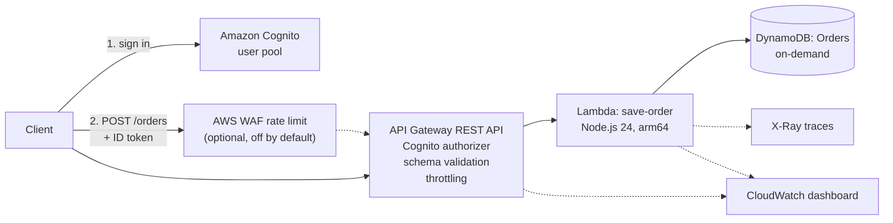
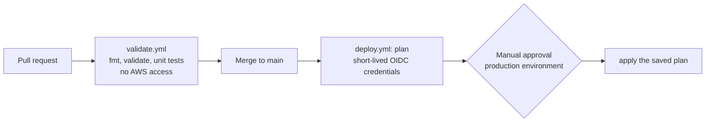

# Secure Serverless Orders API on AWS

A small serverless API built the way a production one should be: authenticated, validated, least-privilege,
observable, and deployed through a pipeline that holds no AWS keys. Everything is Terraform.

[](https://github.com/bdahiya2007/secure-serverless-api-aws/actions/workflows/validate.yml)
[](https://github.com/bdahiya2007/secure-serverless-api-aws/actions/workflows/deploy.yml)

An authenticated client sends `POST /orders`. API Gateway checks the Cognito token and the request shape, a
Node.js Lambda validates it again and writes one item to DynamoDB, and the result is traced and charted.

## Architecture



**Delivery pipeline:** nothing reaches AWS without a reviewed pull request, and nothing changes AWS without an approval.



## What this demonstrates

- **Infrastructure as code, modular:** six reusable Terraform modules with validated inputs and plan-time guardrails.
- **Security by default:** least-privilege IAM, a permissions boundary, no stored credentials, defense in depth on input.
- **Cost awareness:** idle cost is about $0, and every billed feature is off until deliberately enabled.
- **Delivery discipline:** PR validation without AWS access, OIDC to AWS, manual approval, remote locked state.
- **Operability:** a CloudWatch dashboard, X-Ray tracing, structured logs with bounded retention.

## Security design

| Area | What is in place |
|---|---|
| **Authentication** | Cognito user pool (Lite tier), admin-created users only, strong password policy, optional TOTP MFA. API Gateway rejects requests without a valid ID token before the Lambda runs. |
| **Input handling** | The API validates the body against a JSON Schema, and the Lambda validates again with an allow-list of fields. Malformed JSON and unknown fields get a 400 that never echoes the input. |
| **No overwrites** | Writes use a condition expression, so an existing `orderId` + `itemId` returns 409 instead of being replaced. |
| **Least-privilege IAM** | The Lambda role can `PutItem` on one table ARN and write to its own log group. The module rejects `*` actions and resources at plan time, with one documented exception (X-Ray write actions cannot be scoped). |
| **Permissions boundary** | Every role the pipeline creates must carry a boundary that caps it at logging, X-Ray writes and Orders table data access. |
| **Pipeline identity** | GitHub OIDC with short-lived tokens, no stored keys. The trust policy pins the repository by immutable ID and allows only `main` (plan) and the `production` environment (apply). Pull requests cannot assume it. |
| **Pipeline cannot elevate itself** | The deploy role, boundary and state bucket live in a separately applied `bootstrap` stack. Explicit denies stop the role editing itself or removing the boundary. |
| **State** | Private, versioned, encrypted S3 bucket with TLS-only access and native locking. State and variable files are never committed. |
| **Account hardening** | S3 Block Public Access on for the whole account, deletion protection on the table and user pool. |
| **Repository** | Branch protection (admins included), required pull requests, secret scanning with push protection, GitHub Actions pinned by commit SHA. |
| **Error and log hygiene** | 500 responses are generic, and logs record the error type and request ID, never order contents. |

## Cost awareness

Built and run in a personal AWS account, so cost is a design constraint. Idle cost is effectively zero:
DynamoDB is on-demand, Lambda and Cognito Lite sit inside their free tiers, and dashboards and metrics use only
free AWS-published data. Anything billed is off by default and documented:

| Feature | Approximate cost | State |
|---|---|---|
| AWS WAF per-IP rate limit | About $6/month while attached, billed hourly | Off (`enable_waf`) |
| DynamoDB point-in-time recovery | Per GB stored | Off |
| REST API requests | About $3.50 per million | On, pennies at this scale |

## Repository layout

```
terraform/
├── bootstrap/            # applied manually: state bucket, permissions boundary, CI deploy role
├── environments/dev/     # root configuration for the dev environment
├── modules/              # dynamodb-table, lambda-function, rest-api, cognito-user-pool,
│                         # waf-rate-limit, cloudwatch-dashboard
└── README.md             # full technical reference and runbook
src/save-order/           # Lambda source and unit tests
.github/workflows/        # validate.yml and deploy.yml
docs/                     # IAM policy for the engineer's SSO permission set
```

## Try it

Setup, deployment and the cost switches are documented in the [Terraform reference](terraform/README.md),
including how to create a test user. Once deployed, a call looks like this:

```bash
curl -X POST "$API_URL/orders" \
  -H "Authorization: $ID_TOKEN" -H "Content-Type: application/json" \
  -d '{"orderId":"o-1001","itemId":"i-1","quantity":2,"price":9.99}'
```

| Response | Meaning |
|---|---|
| `201` | Saved |
| `400` | Rejected by API Gateway or the Lambda: invalid body |
| `401` | Missing or invalid token |
| `409` | That order item already exists |

The Lambda logic has 15 unit tests using Node's built-in runner and no dependencies:

```bash
node --test src/save-order/
```

## Design decisions

- **REST API, not HTTP API.** The requirement named a REST API, which also provides request validation and
  usage controls. An HTTP API is cheaper and would suit a simpler need.
- **Lambda proxy integration** instead of VTL mapping templates, so the function owns the contract and can be
  tested without API Gateway.
- **Node.js 24, not 26.** Node.js 26 is still a Lambda public preview, so the latest generally available runtime
  was used.
- **Runtime-included AWS SDK.** This avoids an npm build step. AWS recommends bundling the SDK for strict version
  control, which is a listed follow-up.
- **ID token authorizer.** Simplest correct option for a first version. Scopes and an access-token flow would suit
  multiple resource servers.
- **Separate bootstrap stack.** Slightly more manual work, in exchange for a pipeline that cannot rewrite its own permissions.

## Not implemented

Read, list, update and delete endpoints, and per-user ownership of orders. Multiple environments, multi-region
disaster recovery, API access logs and CloudWatch alarms. Hosted sign-in with PKCE for browser clients, and
the X-Ray SDK for DynamoDB sub-segments. The first two items are the most natural next steps.

## Related

[three-tier-web-app-aws](https://github.com/bdahiya2007/three-tier-web-app-aws) is another project in this portfolio.
It uses the same OIDC, approval-gated deployment approach with CloudFormation.
